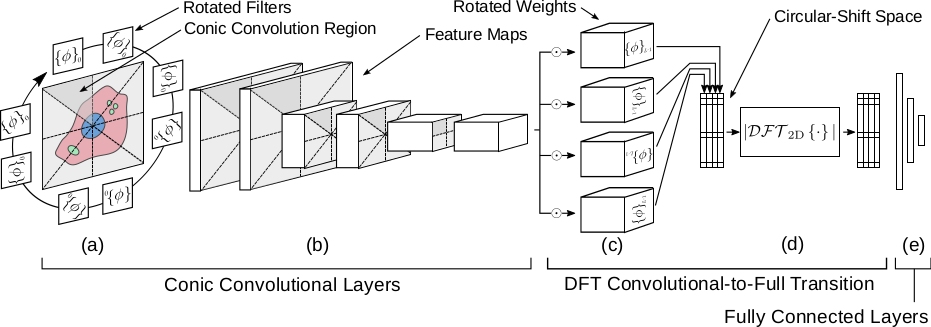
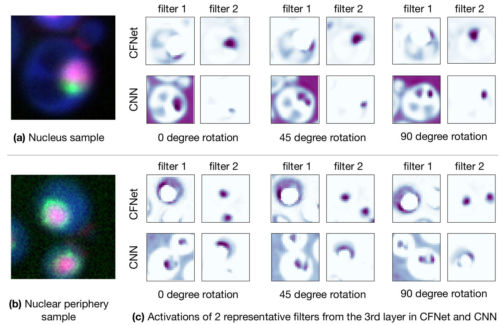

# CFNet

Conic Convolution and DFT Network (CFNet) combines a novel rotation equivariant convolution scheme, called conic convolution, and the DFT to aid networks in learning rotation-invariant tasks.
This network has been especially designed to improve performance of CNNs on automated computational tasks related to microscopy image analysis.



A primary advantage of conic convolution is that, since feature maps directly rotate with the input image, learned features can be easily interpreted and are expected to be more meaningful to the specific task, since they are not confounded with rotation.

## Installation

Required Python packages: TensorFlow, Numpy

From within the main folder, run the following from the command line:
```
python setup.py install
```

